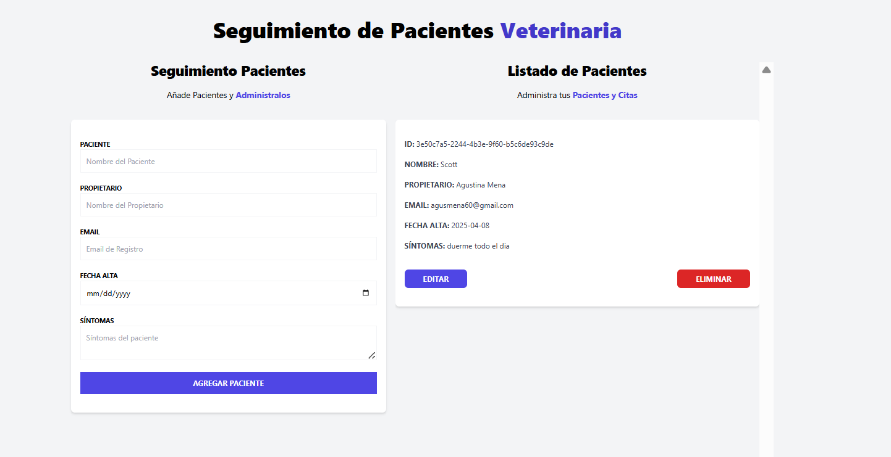

# 🐾 Veterinaria - Seguimiento de Turnos

Aplicación web desarrollada con **React + TypeScript** para gestionar turnos veterinarios. Permite registrar pacientes, editar información y llevar un control claro de los turnos.

## ✨ Vista previa


👉 [Visitar la app](https://tu-enlace.netlify.app)


## 🚀 Tecnologías utilizadas

- ⚛️ React+ Vite
- 🟦 TypeScript
- 🧠 Zustand para gestión de estado
- 🛠️ Redux DevTools
- 📋 React Hook Form para formularios
- 🔔 React Toastify para notificaciones

## ⚙️ Instalación

1. Clonar el repositorio:

    ```bash
    git clone https://github.com/tu-usuario/seguimiento-turnos-veterinaria.git

2. Instalar dependencias:
    ```bash
    npm install

3. Iniciar el servidor de desarrollo:
    ```bash
    npm run dev

## 🧩 Funcionalidades

- Registro y edición de pacientes
- Gestión visual de turnos
- Notificaciones amigables al usuario
- Persistencia local automática de datos con `localStorage` (usando `zustand/persist`)

## Autora: 

- 👩🏽‍💻[Agustina Mena](https://www.linkedin.com/in/agustina-mena-169298204/)
